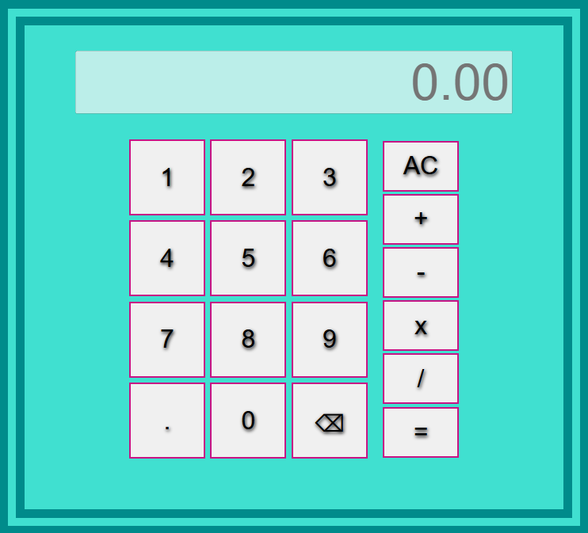

# Calculadora

> Uma calculadora simples feita com JavaScript, HTML e CSS.

## 🚀 Live Preview

**[Clique aqui para testar o projeto](https://elvismourab.github.io/calculator/)**

## 📖 Descrição

Este projeto faz parte do currículo do [The Odin Project](https://www.theodinproject.com). O objetivo é aplicar os fundamentos do Javascript aprendidos por todo o <i>Foundations Course</i>.

[Project: Calculator](https://www.theodinproject.com/lessons/foundations-calculator)

## ✨ Funcionalidades
- Operações básicas.
- Suporte a números de ponto flutuante.
- Suporte a teclado.

## 🛠️ Tech Stack
- HTML5
- CSS3
- JavaScript

## 🧠 O que aprendi

- **Separar estrutura e comportamento**: Elementos que existem sempre devem estar no HTML (estrutura semântica, acessibilidade e desempenho). Elementos que mudam durante a execução ou nascem por interação devem ser criados/geridos pelo JavaScript (estado/dados).

- **Pensar em termos de estado**: Modelar a calculadora como estado facilita lógica e previsibilidade. No projeto usei quatro variáveis-chave: currentValue, nextValue, currentOperator, nextOperator — cada ação do usuário transforma esse estado de forma determinística.

- **Mapear o fluxo do usuário antes de implementar**: Analisar e desenhar o fluxo (eventos → estado → transição → ação) foi decisivo para resolver comportamentos ambíguos e evitar bugs. Mapear casos (numbers, commands) tornou a implementação limpa e testável.

## 💻 Como Executar Localmente

1. Clone o repositório.
2. Entre no diretório.
3. Abra o `index.html` no navegador.
